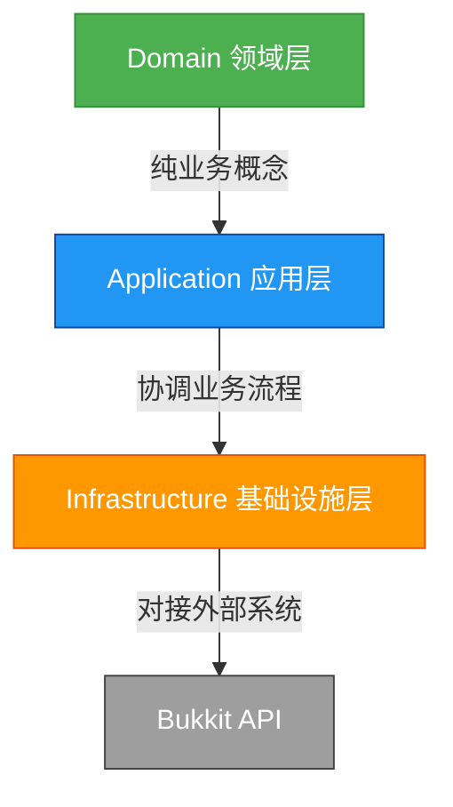
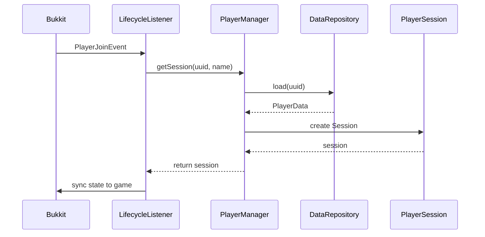
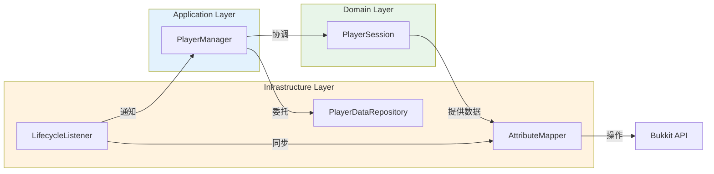

# 玩家系统架构设计文档

**最后更新**：2026年2月13日

**编辑者**：LaoMaoMAG 

> **警告：此文档暂未完善**

---

## 架构核心原则

### 🧱 三层分离架构


| 层级 | 职责 | 依赖约束 | 可测试性 |
|------|------|----------|----------|
| **Domain** | 业务概念定义（种族/职业/属性） | ❌ 禁止依赖任何外部系统 | ✅ 100% 单元测试 |
| **Application** | 业务规则编排（计算/状态流转） | → Domain | ✅ 100% 单元测试 |
| **Infrastructure** | 外部系统集成（Bukkit/数据库） | → Application + 外部API | ⚠️ 集成测试 |

### 🔒 防腐层（Anti-Corruption Layer）
> **核心价值**：领域模型永不被 Bukkit 污染
> - 所有 Bukkit 交互**仅限** `player.bukkit` 包
> - 业务代码**禁止** `import org.bukkit.*`

### ✅ 依赖方向铁律
```
Domain → Application → Infrastructure → External Systems
   ↑_________________________________________|
                ❌ 禁止反向依赖
```

---

## 顶层项目结构

```markdown
com.tingyu/
├── common/          # 通用基础设施（跨模块复用）
├── player/          # 👑 玩家领域核心（Domain + Application）
├── player.bukkit/   # 🌉 Bukkit 映射层（Infrastructure）
├── admin/           # 管理员工具（Application）
└── Main.kt          # 插件主入口
```

| 模块 | 职责定位 | 架构层级 | 关键约束 |
|------|----------|----------|----------|
| `common/` | 跨领域通用契约 | Infrastructure | 仅含接口/工具类，无业务逻辑 |
| `player/` | 玩家业务核心 | Domain + Application | 0 Bukkit 依赖 |
| `player.bukkit/` | Bukkit 交互桥接 | Infrastructure | 唯一允许 Bukkit 依赖的包 |

---

## 核心模块详解

### 3.1 `player/` - 玩家领域核心

#### 📌 模块职责
> **纯业务领域**，包含玩家所有业务概念与规则，**零外部依赖**

| 子模块 | 职责 | 架构层级 | 关键类 |
|--------|------|----------|--------|
| `player.race/` | 种族领域模型 | Domain | `Race.kt` |
| `player.job/` | 职业领域模型 | Domain | `Job.kt` |
| `player.attribute/` | 属性系统 | Domain + Application | `AttributeType.kt`, `AttributeCalculator.kt` |
| `player.data/` | 数据载体 | Domain | `PlayerData.kt` |
| **`player/` 根** | 生命周期协调 | Application | `PlayerManager.kt`, `PlayerSession.kt` |

#### 🧩 核心类设计

##### `PlayerSession` - 单个玩家运行时上下文
```kotlin
class PlayerSession(
    val uuid: UUID
) {
    ...
}
```
> ✅ **设计原则**：
> - 持有玩家**所有运行时状态**
> - 提供**纯业务操作**（无 Bukkit/IO）
> - 可**完全脱离 Minecraft 环境**测试

##### `PlayerManager` - 玩家生命周期协调者
```kotlin
object PlayerManager {
    ...
}
```
> ✅ **设计原则**：
> - **协调者而非执行者**：只管理会话生命周期，不直接操作数据/映射
> - **依赖倒置**：通过 `PlayerDataRepository` 接口解耦持久化实现
> - **线程安全**：`ConcurrentHashMap` 保障并发安全

#### 生命周期流程


---

### 3.2 `common/` - 通用基础设施

#### 📌 模块职责
> **跨领域契约定义**，为所有业务模块提供通用能力

| 子模块 | 职责 | 复用场景 |
|--------|------|----------|
| `common.interfaces/` | 通用行为契约 | `Displayable`（种族/职业/物品品质）<br>`Validatable`（有效值校验） |
| `common.util/` | 通用工具函数 | 字符串处理/数学计算 |

#### 💡 接口设计范式
```kotlin
// common/interfaces/Displayable.kt
interface Displayable {
    val displayName: String
    fun getDisplayText(): String = displayName // 默认实现
}

// 使用示例（跨模块复用）
enum class Race(...) : Displayable { ... }   // player 模块
enum class ItemRarity(...) : Displayable { ... } // item 模块
```
> ✅ **设计原则**：
> - 接口**仅定义行为**，不包含业务语义
> - 默认实现**最小化**，保留扩展空间
> - 命名**通用化**（避免 `PlayerDisplayable` 这类领域绑定名称）

---

### 3.3 `player.bukkit/` - Bukkit 映射层

#### 📌 模块职责
> **唯一允许 Bukkit 依赖的包**，负责领域模型 ↔ Bukkit API 的双向映射

| 类 | 职责 | 映射方向 | 关键约束 |
|----|------|----------|----------|
| `PlayerLifecycleListener.kt` | 事件监听桥接 | Bukkit → Domain | 仅转发事件，无业务逻辑 |
| `AttributeMapper.kt` | 属性同步 | Domain → Bukkit | 无状态，纯函数式 |
| `DamageCalculator.kt` | 伤害处理 | 双向 | 业务计算委托给 `AttributeCalculator` |

#### 🌉 防腐层实现
```kotlin
// player.bukkit/PlayerLifecycleListener.kt
object PlayerLifecycleListener : Listener {
    @EventHandler
    fun onPlayerJoin(event: PlayerJoinEvent) {
        // 1. 通知领域层加载会话（纯业务）
        val session = PlayerManager.getSession(
            event.player.uniqueId,
            event.player.name
        )
        
        // 2. 通知映射层同步状态（技术细节）
        AttributeMapper.syncMaxHealth(event.player, session.attributes)
        AttributeMapper.syncWalkSpeed(event.player, session.attributes)
    }
}
```
> ✅ **设计原则**：
> - **事件监听器 = 纯桥接**：只调用 `PlayerManager`，不包含业务判断
> - **映射器 = 无状态函数**：输入领域模型，输出 Bukkit 操作
> - **业务计算委托**：`DamageCalculator` 调用 `AttributeCalculator`，自身不实现公式

#### ⚠️ 严格禁止
```kotlin
// ❌ 反模式：业务逻辑混入映射层
fun onPlayerJoin(event: PlayerJoinEvent) {
    if (event.player.hasPermission("vip")) { // ← 业务判断
        event.player.maxHealth = 40.0        // ← 直接操作 Bukkit
    }
}

// ✅ 正确：业务判断在领域层，映射层只负责同步
fun onPlayerJoin(event: PlayerJoinEvent) {
    val session = PlayerManager.getSession(...)
    if (session.isVip) {                    // ← 业务判断在 PlayerSession
        AttributeMapper.syncMaxHealth(...)  // ← 映射层只同步
    }
}
```

---

## 模块交互协议

### 🔗 依赖关系图


### 📜 交互契约
| 交互方向 | 协议 | 示例 |
|----------|------|------|
| **Bukkit → Domain** | 事件驱动 | `PlayerJoinEvent` → `PlayerManager.getSession()` |
| **Domain → Bukkit** | 显式同步 | `PlayerSession.changeJob()` → `AttributeMapper.sync()` |
| **Domain ↔ Data** | 依赖抽象 | `PlayerManager` 依赖 `PlayerDataRepository` 接口 |

---

## 架构验证清单

### ✅ 业务层健康检查
- [ ] 所有 `player/` 代码**无** `import org.bukkit.*`
- [ ] `PlayerSession` 可在 **JUnit 测试**中独立实例化
- [ ] `AttributeCalculator` 单元测试**无需** Bukkit 环境
- [ ] 种族/职业枚举**仅**实现 `Displayable`/`Validatable`

### 🔒 防腐层健康检查
- [ ] **仅** `player.bukkit/` 包含 Bukkit 依赖
- [ ] `PlayerLifecycleListener` **无**业务判断逻辑
- [ ] 所有属性计算**委托**给 `AttributeCalculator`（非在映射层实现）
- [ ] 伤害公式**不在** `DamageCalculator` 中硬编码

### 🧪 可测试性验证
```kotlin
// ✅ 100% 可测试的业务逻辑
@Test
fun `战士转职后物理攻击应增加`() {
    val session = PlayerSession(UUID.randomUUID(), "测试玩家")
    session.changeJob(Job.WARRIOR)
    
    assertEquals(3.0, session.attributes.getBonus(AttributeType.PHYSICAL_ATTACK))
}

// ✅ 无需 Bukkit 的属性计算测试
@Test
fun `防御力50应减免33%伤害`() {
    val reduced = AttributeCalculator.calculateDamageReduction(100.0, 50.0)
    assertEquals(66.7, reduced, 0.1)
}
```

---

## 架构心法
> **"业务逻辑永不触碰 Bukkit，  
> 游戏表现仅在 bukkit 包，  
> 两者之间有防腐桥梁，  
> 演进弹性自然而来"** ✨
